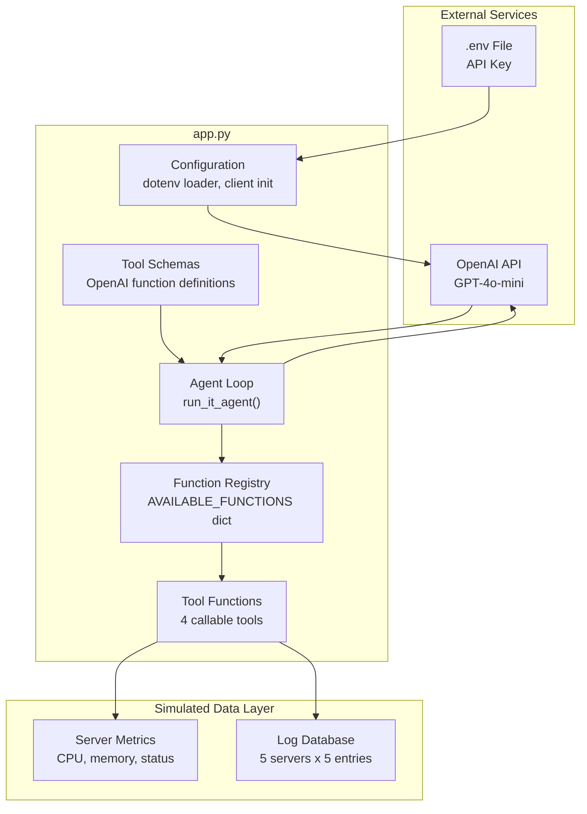
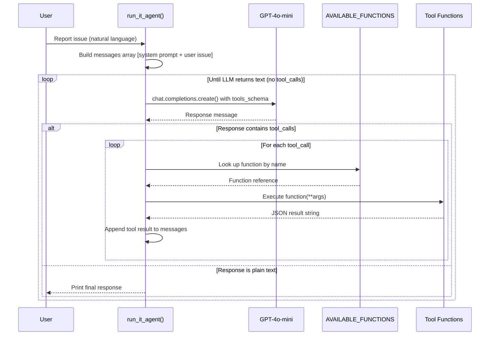
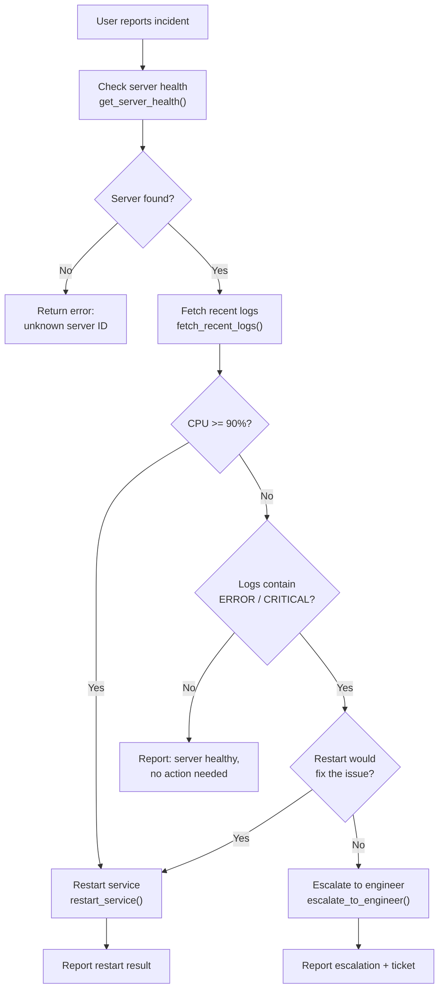
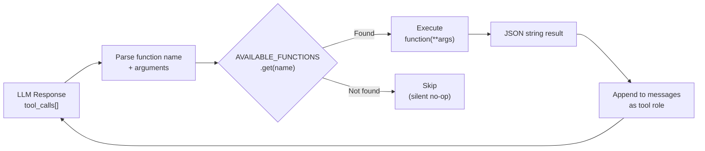
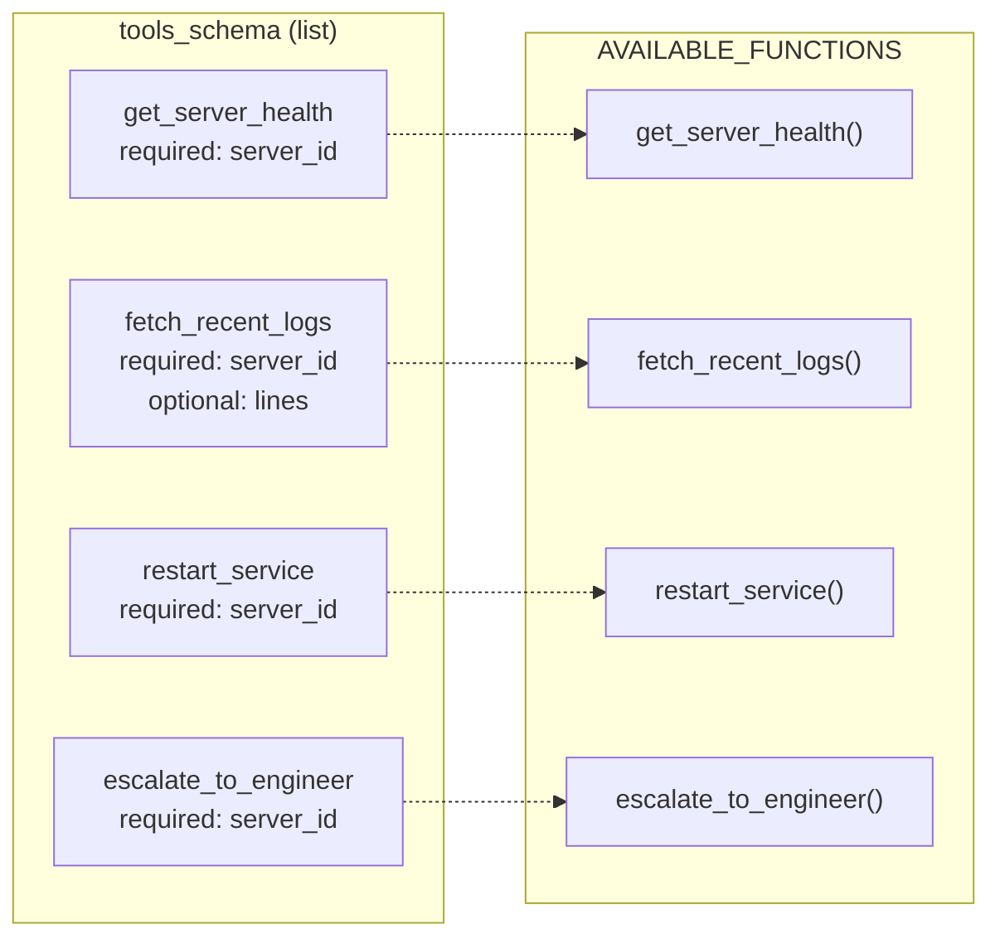

# IT Support Agent — Design Documentation

> An AI-powered first responder for server incidents that investigates health metrics, takes automated corrective action, and escalates complex issues to human engineers.

**Version:** 1.0  
**Stack:** Python / OpenAI GPT-4o-mini  
**Architecture:** Single-module (`app.py`)

---

## Table of Contents

1. [System Overview](#1-system-overview)
2. [Architecture](#2-architecture)
3. [Agent Loop](#3-agent-loop)
4. [Decision Logic](#4-decision-logic)
5. [Tool Registry](#5-tool-registry)
6. [Data Models](#6-data-models)
7. [Server Scenarios](#7-server-scenarios)
8. [Dependencies](#8-dependencies)
9. [Known Issues](#9-known-issues)

---

## 1. System Overview

The IT Support Agent is a prototype incident response system built on the OpenAI function-calling pattern. When a user reports a server issue in natural language, the agent autonomously investigates by checking server health metrics and logs, then decides on one of three actions:

- **Investigate** — query CPU, memory, and status; pull recent log entries
- **Act** — restart a service when CPU exceeds 90%
- **Escalate** — create a ticket for a human engineer when logs reveal critical errors a restart cannot resolve

The system uses GPT-4o-mini as the reasoning engine and exposes four tools via the OpenAI tool-use protocol. All server data is currently simulated with in-memory dictionaries covering five hardcoded server scenarios.

> **Scope:** This is a demonstration prototype. There is no persistent storage, no HTTP API, and no live server integration. The entry point `run_it_agent()` must be called programmatically.

---

## 2. Architecture

The system follows a single-module architecture where all components — configuration, tool functions, schema definitions, and the agent loop — reside in `app.py`. The LLM acts as the orchestrator, deciding which tools to invoke based on the user's reported issue and the results of previous tool calls.

### Component Architecture



### Key Design Decisions

- **Single-file architecture:** Keeps the prototype simple and self-contained with no package or module structure
- **Registry pattern:** The `AVAILABLE_FUNCTIONS` dictionary maps tool names to callables, enabling dynamic dispatch from LLM tool calls
- **Simulated data:** Hardcoded dictionaries stand in for real monitoring APIs, making the system runnable without infrastructure
- **Stateless execution:** Each invocation of `run_it_agent()` is independent with no persistent state between runs

---

## 3. Agent Loop

The agent operates on a synchronous request-response loop. Each iteration sends the full conversation history to the LLM, which either returns a tool call (continuing the loop) or a plain text response (terminating the loop). The LLM decides which tools to call and in what order based on the system prompt and accumulated context.

### Agent Execution Sequence



### Message Accumulation

The messages array grows with each iteration. Every LLM response and every tool result is appended, giving the model full context for its next decision. A typical conversation shape:

| Turn | Role        | Content                                              |
|------|-------------|------------------------------------------------------|
| 0    | `system`    | Level 1 IT Responder instructions                    |
| 1    | `user`      | Reported issue text                                  |
| 2    | `assistant` | Tool call: `get_server_health`                       |
| 3    | `tool`      | Health metrics JSON                                  |
| 4    | `assistant` | Tool call: `fetch_recent_logs`                       |
| 5    | `tool`      | Log entries JSON                                     |
| 6    | `assistant` | Tool call: `restart_service` or `escalate_to_engineer` |
| 7    | `tool`      | Action result JSON                                   |
| 8    | `assistant` | Final text summary to user                           |

---

## 4. Decision Logic

The LLM is guided by the system prompt to follow a triage protocol: check health, inspect logs, and then either restart the service or escalate. The tool functions themselves also enforce guardrails — `restart_service` will only execute a restart when CPU is at or above 90%.

### Incident Triage Flowchart



> **LLM discretion:** The flowchart shows the intended logic, but the actual decision path is determined by the LLM at runtime. The model may call tools in different orders or skip steps based on its interpretation of the user's issue and accumulated context.

---

## 5. Tool Registry

Four tools are registered in the `AVAILABLE_FUNCTIONS` dictionary and exposed to the LLM via `tools_schema`. Each tool accepts a server ID, interacts with the simulated data layer, and returns a JSON string.

### `get_server_health(server_id: str) -> str`

Looks up CPU usage, memory usage, and status for a given server ID from the hardcoded metrics dictionary. Returns a JSON object with a `metrics` key containing the health data, or an error if the server ID is not recognized.

### `fetch_recent_logs(server_id: str, lines: int = 5) -> str`

Returns the last N log lines for a server from the simulated log database. Each server has 5 predefined entries spanning INFO, WARN, ERROR, and CRITICAL severities. Returns a JSON object with a `logs` array.

### `restart_service(server_id: str) -> str`

Checks the server's CPU via `get_server_health`. If CPU >= 90%, returns a success response simulating a restart. If below threshold, returns a "skipped" response. Acts as a guardrail preventing unnecessary restarts.

### `escalate_to_engineer(server_id: str) -> str`

Fetches logs and filters for ERROR or CRITICAL entries. If problem logs are found, returns an escalation response with the relevant log lines. Intended for issues that automated restarts cannot resolve.

### Tool Dispatch Flow



---

## 6. Data Models

The system uses plain Python dictionaries throughout. No formal schemas, classes, or validation layers exist.

### Server Health Response

```json
{
  "metrics": {
    "cpu": "98%",
    "memory": "40%",
    "status": "Warning"
  }
}
```

Status values: `"Healthy"` | `"Warning"` | `"Critical"` | `"Error"`

### Log Response

```json
{
  "logs": [
    "[INFO] Health check passed",
    "[WARN] CPU threshold exceeded 90%",
    "[ERROR] Connection refused: elastic-cluster-main:9200",
    "[CRITICAL] Application crashing due to memory leak"
  ]
}
```

### Action Responses

| Tool                    | Status Values                    | Shape                        |
|-------------------------|----------------------------------|------------------------------|
| `restart_service`       | `success`, `skipped`, `error`    | `{ status, message }`        |
| `escalate_to_engineer`  | `escalate`, `error`              | `{ status, message, logs[] }` |

### Schema to Function Mapping



---

## 7. Server Scenarios

Five hardcoded server scenarios cover the range of incident types the agent is designed to handle.

| Server ID            | Scenario                      | CPU  | Memory | Status     | Expected Action       |
|----------------------|-------------------------------|------|--------|------------|-----------------------|
| `payment-server-01`  | High CPU, process hung        | 98%  | 40%    | Warning    | Restart service       |
| `db-node-02`         | Healthy, normal operation     | 12%  | 60%    | Healthy    | No action needed      |
| `auth-service-03`    | Memory leak, OOM errors       | 45%  | 95%    | Critical   | Escalate to engineer  |
| `search-index-09`    | Dependency down, conn refused | 10%  | 15%    | Error      | Escalate to engineer  |
| `frontend-node-04`   | Fully normal                  | 25%  | 30%    | Healthy    | No action needed      |

### Scenario Coverage

```mermaid
quadrantChart
    title Server Scenario Coverage
    x-axis Low CPU --> High CPU
    y-axis Low Memory --> High Memory
    quadrant-1 Escalate (memory)
    quadrant-2 Restart (CPU)
    quadrant-3 No action
    quadrant-4 No action
    auth-service-03: [0.45, 0.95]
    payment-server-01: [0.98, 0.40]
    db-node-02: [0.12, 0.60]
    search-index-09: [0.10, 0.15]
    frontend-node-04: [0.25, 0.30]
```

---

## 8. Dependencies

The project declares five packages in `requirements.txt`. Only two are actually imported and used in the codebase.

| Package         | Status   | Purpose                                                |
|-----------------|----------|--------------------------------------------------------|
| `openai`        | **Used** | OpenAI Python SDK for chat completions with tool use   |
| `python-dotenv` | **Used** | Reads `OPENAI_API_KEY` from the project's `.env` file  |
| `streamlit`     | Unused   | Not imported. Likely intended for a future web UI      |
| `pandas`        | Unused   | Not imported. Possibly planned for data analysis       |
| `tabulate`      | Unused   | Not imported. Possibly planned for formatted output    |

### Configuration

- **Environment variable:** `OPENAI_API_KEY` read from `.env` via `dotenv_values()`
- **LLM model:** Hardcoded as `gpt-4o-mini` (line 219 of `app.py`)
- No configuration mechanism exists to change settings without editing source

---

## 9. Known Issues

Listed in order of severity.

### Missing return in `escalate_to_engineer`

**Location:** `app.py:128-133`

When `problem_logs` is empty (no ERROR/CRITICAL entries found), the function falls through without a return statement, implicitly returning `None`. This `None` is passed as the tool output to the OpenAI API, which may cause unexpected behavior or an API error.

### Schema mismatch in `escalate_to_engineer`

**Location:** `app.py:200`

The `tools_schema` entry declares `"required": ["summary"]`, but the parameters only define `server_id`. There is no `summary` parameter. This mismatch could confuse the LLM or cause validation errors.

### Placeholder description in `restart_service` schema

**Location:** `app.py:179`

The tool schema has `"description": "### TODO: Write a description for the AI"`. This placeholder is sent to the LLM and may reduce the quality of tool selection decisions.

### No entry point to run the application

There is no `if __name__ == "__main__"` block, no CLI argument parsing, and no Streamlit app wiring. The `run_it_agent()` function is defined but never called.

### No error handling in agent loop

**Location:** `app.py:215-249`

The `while True` loop has no try/except handling. An OpenAI API error, a tool function exception, or a JSON parse failure will crash the entire agent with an unhandled exception.

### Silent no-op on unknown tool names

**Location:** `app.py:235-244`

If the LLM requests a tool name not in `AVAILABLE_FUNCTIONS`, the registry lookup returns `None` and the tool call is silently skipped. No tool result is appended, which may leave the LLM in an inconsistent state.
