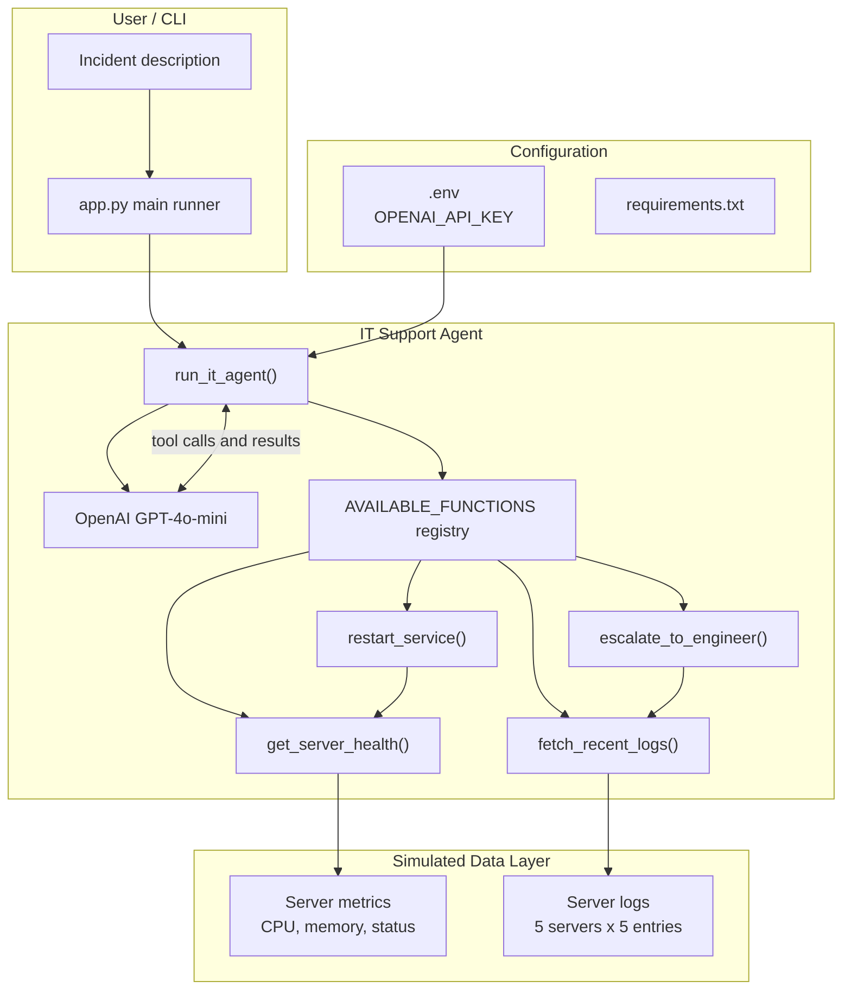
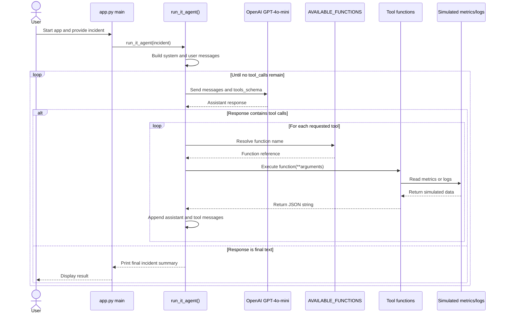
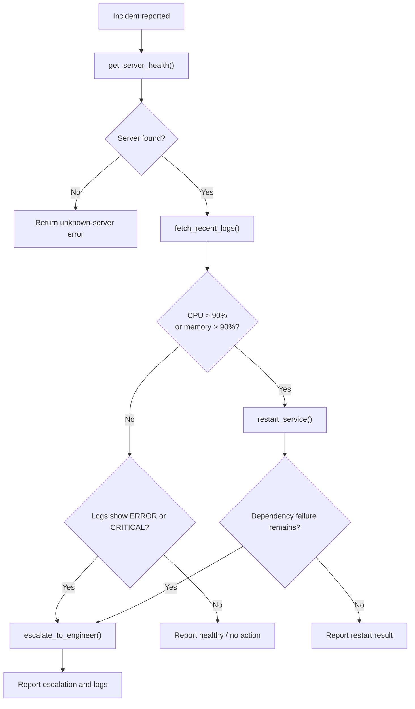
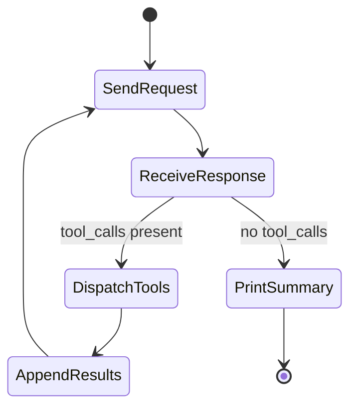
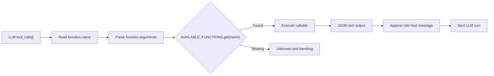
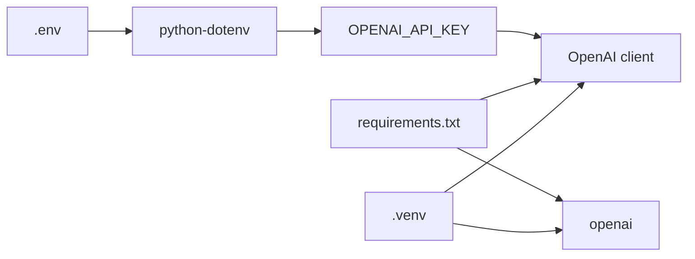

# Architecture

## System Overview

The IT Support Agent is a command-line incident responder. A natural-language incident is sent to OpenAI GPT-4o-mini, which uses the registered tools to inspect simulated server metrics and logs, restart services when resource usage is critical, and escalate dependency failures to a human engineer.

## Request Flow

## Incident Decision Flow

The model orchestrates the order of tool calls, while the tool functions enforce local guardrails. `restart_service()` restarts only when CPU or memory is greater than 90%. `escalate_to_engineer()` identifies `ERROR` and `CRITICAL` log entries and returns an escalation result when any are present.

## Agent Loop

The conversation history is accumulated across model turns:

| Turn  | Role                 | Content                            |
| ----- | -------------------- | ---------------------------------- |
| 0     | `system`             | Level 1 responder instructions     |
| 1     | `user`               | Natural-language incident          |
| 2     | `assistant`          | Tool call request                  |
| 3     | `tool`               | JSON health or log result          |
| 4+    | `assistant` / `tool` | Additional investigation or action |
| Final | `assistant`          | Human-readable incident summary    |

## Tool Registry

`tools_schema` describes the functions to the OpenAI API. `AVAILABLE_FUNCTIONS` performs the runtime dispatch from the model-selected function name to the Python callable.

| Tool                   | Responsibility                         | Data source        |
| ---------------------- | -------------------------------------- | ------------------ |
| `get_server_health`    | Return CPU, memory, and status         | Metrics dictionary |
| `fetch_recent_logs`    | Return the latest log entries          | Log dictionary     |
| `restart_service`      | Restart when CPU or memory exceeds 90% | Health result      |
| `escalate_to_engineer` | Escalate ERROR or CRITICAL logs        | Log result         |

## Server Scenarios

| Server              | Metrics             | Logs                                | Expected action                  |
| ------------------- | ------------------- | ----------------------------------- | -------------------------------- |
| `payment-server-01` | CPU 98%, memory 40% | Hung process, timeout               | Restart, possibly escalate       |
| `db-node-02`        | CPU 12%, memory 60% | Normal INFO entries                 | No action                        |
| `auth-service-03`   | CPU 45%, memory 95% | OutOfMemoryError, memory leak       | Restart and investigate/escalate |
| `search-index-09`   | CPU 10%, memory 15% | Connection refused, dependency down | Escalate                         |
| `frontend-node-04`  | CPU 25%, memory 30% | Successful 200 responses            | No action                        |

The `__main__` block runs these five scenarios sequentially for demonstration and debugging.

## Dependencies and Configuration

- **Runtime:** Python 3.10+
- **LLM:** `gpt-4o-mini`
- **Configuration:** `OPENAI_API_KEY` in `.env`
- **Environment:** `.venv`
- **Entry point:** `python app.py`
- **Debugging:** `.vscode/launch.json` uses the project virtual environment

## Scope

This is a demonstration prototype. Metrics and logs are hardcoded in memory, restarts are simulated, escalation creates no persistent ticket, and there is no live monitoring API or database.
